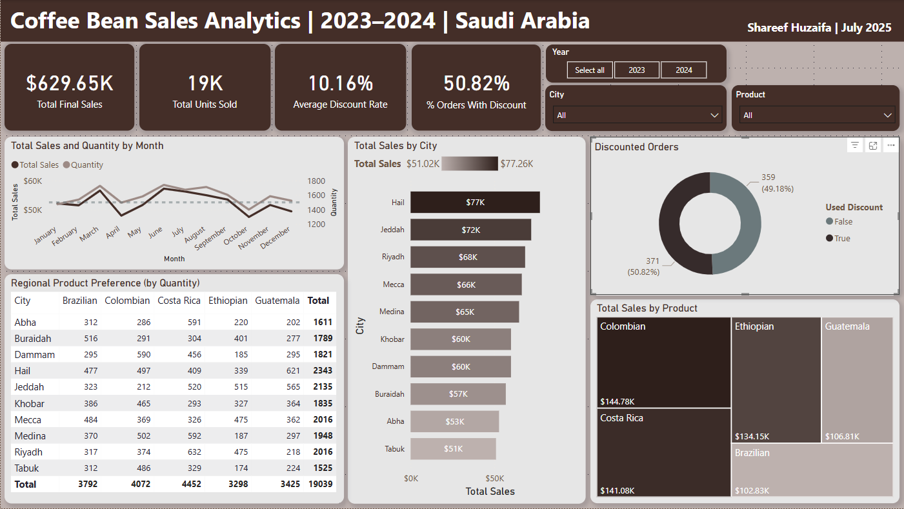
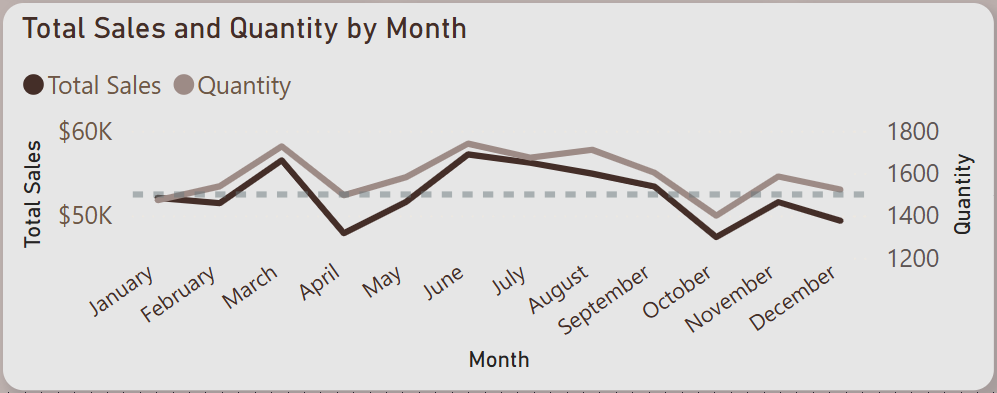
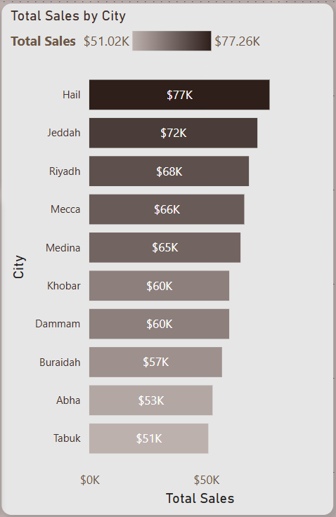
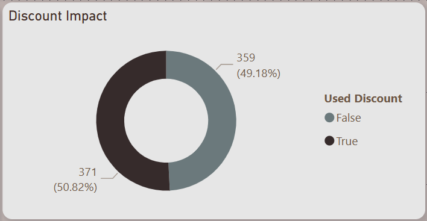
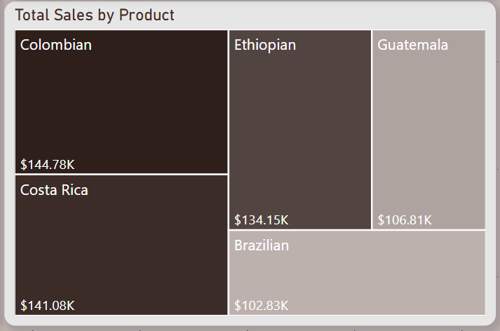
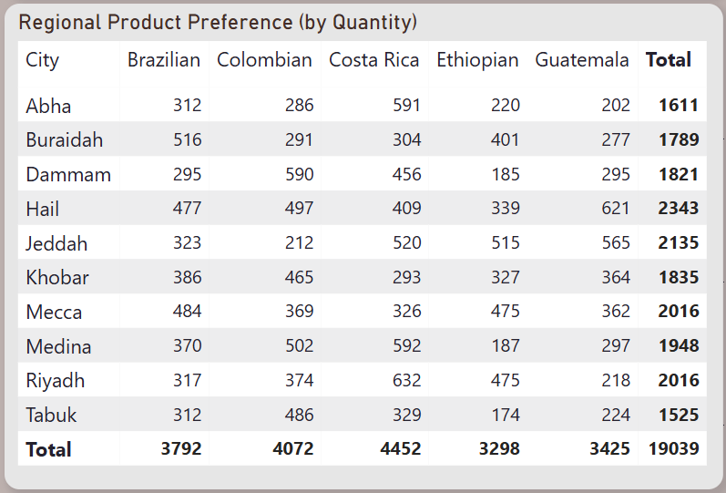

# ☕ Coffee Bean Sales Analytics – Power BI Dashboard  
📊 **End-to-End Power BI Case Study | Regional Sales | Product Demand | Discount Behavior**  
🌐 **[🔗 View Live Dashboard (Power BI Web)](https://app.powerbi.com/view?r=eyJrIjoiMmI3ZTg0YTUtZWNmMS00OTQ1LTg3ZjYtMDRmYjdlYzAyY2I5IiwidCI6IjY3NDM4ODYzLThjOTItNGQ0ZC1iMjAyLTIzNmZjMjNhZDk2MCIsImMiOjl9)**

    <b>Dashboard Overview</b>  
     
    

---

## 🔍 Project Overview  
This Power BI dashboard explores **coffee bean sales across 10 cities in Saudi Arabia** during **2023 and 2024**.  
The goal was to create a focused, interactive, and visually cohesive report to reveal **regional product trends**, **monthly performance**, and **customer discount behavior**.

### 🚀 Key Objectives  
✅ Track overall sales volume and performance by product and location  
✅ Visualize monthly sales seasonality and quantity fluctuations  
✅ Detect regional preferences across 5 coffee bean products  
✅ Analyze the share and impact of discounted vs full-price sales  

---

## 📂 Dataset & Data Modeling  
🔹 Source: Flat-file dataset (CSV) containing 700+ sales records  
🔹 Key columns: Date, City, Product, Quantity, Unit Price, Discount Rate, Final Sales  
🔹 Added derived columns in Power Query:
- `SaleYear`, `SaleMonth`, `SaleMonthNumber` for calendar intelligence  
- Cleaned currency fields, date types, and boolean values  

No external dimension tables were used — **all transformations were handled in Power Query**.

---

## 📊 Dashboard Features & Pages  

### 🔹 Dashboard KPIs  
✅ Total Final Sales  
✅ Total Units Sold  
✅ Average Discount Rate  
✅ % of Orders With Discount  

### 🔹 Visual Insights  
## 📊 Dashboard Features & Pages  

### 🔹 Dashboard KPIs  
✅ Total Final Sales  
✅ Total Units Sold  
✅ Average Discount Rate  
✅ % of Orders With Discount  

---

### 🔹 Visual Insights  

- Line chart for **Total Sales & Quantity by Month**
- Donut chart for **Discounted vs Non-Discounted Orders**
- Clustered bar chart for **Top Cities by Sales**
- Treemap of **Total Sales by Product**
- Matrix for **Regional Product Preference (by Quantity)**

     
    <i>Sales and Quantity Trend by Month</i>

     
    <i>Top Cities by Sales</i>

     
    <i>Discount Usage Overview</i>

     
    <i>Sales Breakdown by Product</i>

     
    <i>Matrix: Product Demand by City</i>

---

## 📈 Key Insights  
🔹 **Hail** and **Jeddah** had the highest total sales in the dataset  
🔹 **Colombian** and **Costa Rica** beans were most popular overall  
🔹 **51%** of all orders involved discounts, averaging **10.16% discount rate**  
🔹 Sales spiked in **March** and **July**, indicating seasonal patterns  
🔹 Cities like **Buraidah** and **Abha** preferred Costa Rica beans, while **Medina** leaned toward Colombian

---

## 🛠️ How to Use the Dashboard  
1️⃣ Use the slicers (Year, City, Product) to filter views  
2️⃣ Hover over visuals for detailed tooltips  
3️⃣ Read KPIs before drilling into visuals for a top-down view  
4️⃣ Use the matrix to compare **product popularity by region**

---

## 💡 Why This Project Matters  
✅ Real-world retail sales case with time, location, and product segmentation  
✅ Custom calendar logic using Power Query (Month Name, Sort Order)  
✅ Strong visual storytelling with consistent theming and layout  
✅ Highlights how **Power BI** can be used for **lightweight retail analytics** without external tables  

---

## 👨‍💻 About Me  
Hi, I'm **Shareef Ali**, a focused **Data Analyst** with a passion for solving business problems through data.  
This dashboard is part of my portfolio to demonstrate interactive BI reporting for real-world use cases.

📬 **Let’s connect!**  
🔗 **[GitHub Portfolio](https://github.com/shareef99997)**  
🔗 **[LinkedIn](https://www.linkedin.com/in/shareef-ali/)**  
🔗 **[Personal Website](https://www.shareefdev.com)**  

📢 **If this dashboard helped or inspired you, consider leaving a ⭐ on GitHub!**  

